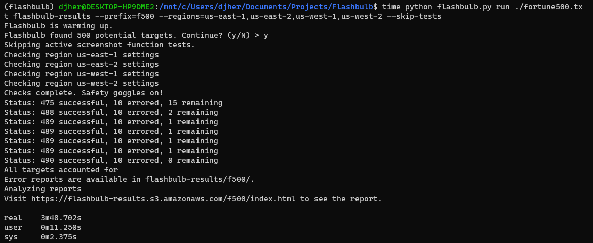
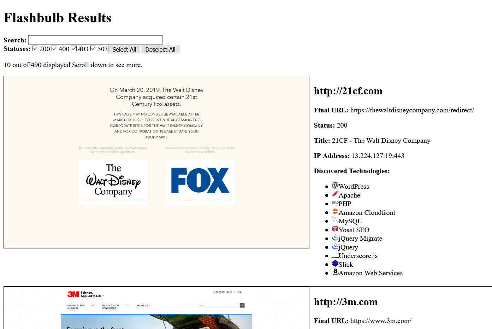

# Flashbulb
Flashbulb is a tool to quickly screenshot and analyze large lists of URLs or IP ranges. Flashbulb uses AWS Lambda functions to massively parralelize the task. Screenshots and reports are uploaded to an S3 bucket of your choice.

## Setup
To use this tool, you must have aws credentials available such as by running `aws configure` using the AWS CLI or through environment variables. [Minimum permissions required here](assets/sample_user_policy.json).

### Install the tool
After cloning the repo, simply run
```bash
pip install boto3
```

### AWS Setup
1. Create a bucket and configure it to serve files as a website
2. Create an IAM Lambda execution role. [Sample policy here](assets/sample_lambda_policy.json).

### Deploy Flashbulb
Run the Flashbulb deploy command to create the required Lambda layers and functions in the specified regions.

```bash
python flashbulb.py deploy <role ARN> <comma-separated list of regions>
```

## Run Flashbulb

```bash
python flashbulb.py run <target list file> <results bucket>
```

Running Flashbulb against the Fortune 500 took about 4 minutes.


The most common error is timeout errors (30 seconds) followed by name resolution errors. Some companies just straight block any requests coming from AWS 😥.

## Viewing Results
Flashbulb will upload an `index.html` to your bucket. If you visit that file in a browser, you can see a searchable output.



## Update Flashbulb
To update your Lambda functions to the latest version run the following commands:

```bash
git pull
python flashbulb.py update <comma-separated list of regions>
```

## Attribution
This project is built using the projects listed below. Huge thanks to the original authors for making such incredible libraries.
* [chrome-aws-lambda](https://github.com/alixaxel/chrome-aws-lambda) by alixaxel
* [Wappalyzer](https://github.com/AliasIO/wappalyzer) by AliasIO